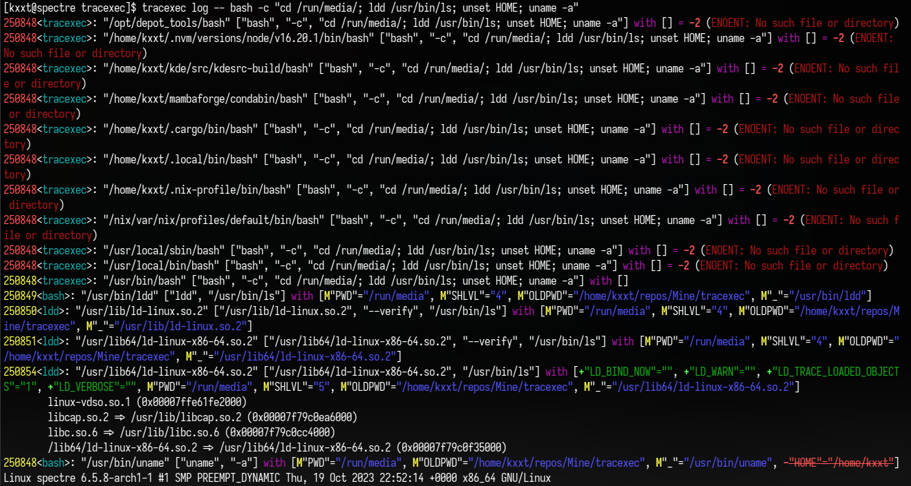

# tracexec

A small utility to trace program execution.

**Status**: 
- Proof of concept.
- Experimental quality. 
- Not ready for production use.
- Performance is not a focus right now.

## Showcase



## Usage

```bash
$ tracexec log -- <command>
```

## Origin

This project was born out of the need to trace the execution of programs.

Initially I simply use `strace -Y -f -qqq -s99999 -e trace=execve,execveat <command>`.

But the output is still too verbose so that's why I created this project.

## Credits

This project takes inspiration from [strace](https://strace.io/) and [lurk](https://github.com/JakWai01/lurk).
