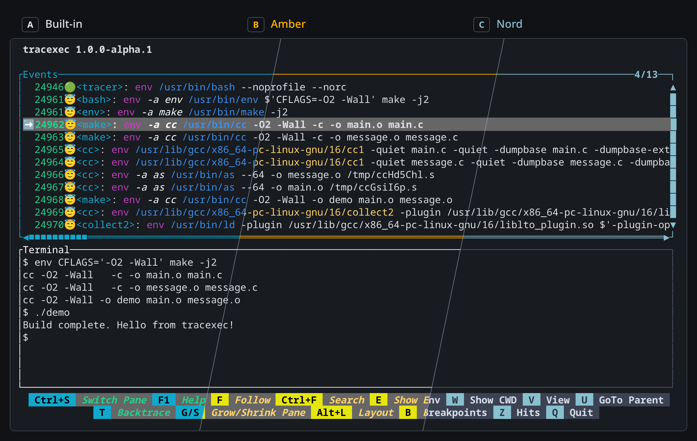

# tracexec

A small utility for tracing execve{,at} and pre-exec behavior.

tracexec helps you to figure out what and how programs get executed when you execute a command.

It's useful for debugging build systems, understanding what shell scripts actually do, figuring out what programs
does a proprietary software run, etc.



- [Installation Guide](INSTALL.md)
- [Showcases](https://tracexec.kxxt.dev/introduction/showcases.html)

## Usage

General CLI help:

```bash
%{general}
```

TUI Mode:

```bash
%{tui}
```

Log Mode:

```bash
%{log}
```

Collect and export data:

```
%{collect}
```

eBPF backend supports similar commands:

```
%{ebpf}
```

## Profile

`tracexec` can be configured with a profile file. The profile file is a toml file that can be used to set fallback options.

The profile file should be placed at `$XDG_CONFIG_HOME/tracexec/` or `$HOME/.config/tracexec/` and named `config.toml`.

A template profile file can be found at https://github.com/kxxt/tracexec/blob/main/config.toml

As a warning, the profile format is not stable yet and may change in the future. You may need to update your profile file when upgrading tracexec.

TUI themes can be configured in the `tui` section of the profile in one of two ways:

```toml
[tui]
theme-file = "nord.toml"
```

`theme-file` accepts either an absolute path or a path relative to the theme directories. Relative paths are resolved relative to the following absolute paths in order:

1. `$XDG_CONFIG_HOME/tracexec/themes/` (or `$HOME/.config/tracexec/themes/`)
2. `$XDG_DATA_HOME/tracexec/themes/` (or `$HOME/.local/share/tracexec/themes/`)
3. `/etc/tracexec/themes`
4. `<path_to_tracexec_binary>/../share/tracexec/themes/`

You can also inline the theme definition directly in the profile. Theme entries patch the built-in default theme, so you only need to specify the parts you want to change.

```toml
[tui]
theme = { app-title = { fg = "cyan" }, active-border = { fg = "light-cyan" } }
```

Example themes are available in the repository's `themes/` directory.

## Known issues

- Non UTF-8 strings are converted to UTF-8 in a lossy way, which means that the output may be inaccurate.
- The output is not stable yet, which means that the output may change in the future.
- The pseudo terminal can't pass through certain key combinations and terminal features.

## Origin

This project was born out of the need to trace the execution of programs.

Initially I simply use `strace -Y -f -qqq -s99999 -e trace=execve,execveat <command>`.

But the output is still too verbose so that's why I created this project.

## Credits

This project takes inspiration from [strace](https://strace.io/) and [lurk](https://github.com/JakWai01/lurk).
