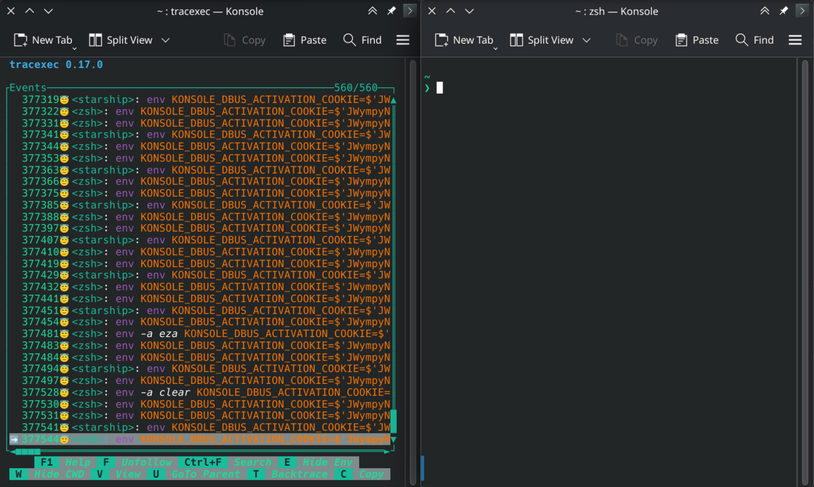

# Built-in Terminal and External Terminal

By default, tracexec uses an internal & built-in terminal when performing a scoped trace of a user-specified command.
The built-in terminal offers a convenient way to interact with the traced processes inside tracexec.
However, the built-in terminal supports limited terminal features and may not work well for some use cases.
As a workaround, you can also let tracexec trace an external terminal emulator.

## Built-in terminal

`tracexec tui` allocates a pseudo-terminal (PTY) for the command by default. The
command's standard input, output, and error streams are connected to the
Terminal pane, while the TUI itself is drawn on the surrounding terminal.

```bash
tracexec tui -- bash
```

Press <kbd>Ctrl</kbd>+<kbd>S</kbd> to switch between the Terminal and Events
panes. If a terminal program needs to receive a literal <kbd>Ctrl</kbd>+<kbd>S</kbd>,
focus the Events pane and press <kbd>Alt</kbd>+<kbd>S</kbd>.

The PTY has a 1,000-line scrollback buffer by default. Change it for one run
with `--scrollback-lines`:

```bash
tracexec tui --scrollback-lines 10000 -- bash
```

## TUI without a terminal pane

Use `--no-tty` when the command needs no interaction:

```bash
tracexec tui --no-tty -- make -j8
```

In this mode the command's stdin, stdout, and stderr are redirected to
`/dev/null`; `--no-tty` does not inherit the outer terminal. Use the
[log frontend](../log.md) if you want the command to keep the current terminal
while tracexec prints events alongside it.

## External Terminal Emulators

To use tracexec with an external terminal emulator, make tracexec trace the external terminal directly.

For example,

```bash
tracexec tui --no-tty -- konsole
```

launches an external konsole terminal emulator in a separate window.



You can also specify the command to run for the external terminal emulator. But the way to do it depends on which terminal emulator you are using.

```bash
# For konsole
tracexec tui --no-tty -- konsole -e "bash"
# For kitty
tracexec tui --no-tty -- kitty bash
```
