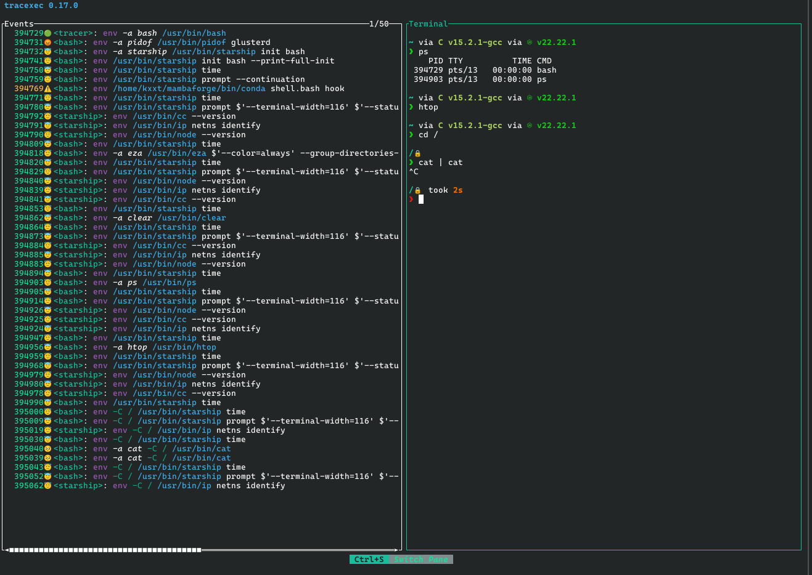

# Introduction

Modern software systems are composed of complex chains of programs that invoke each other dynamically during execution.
Shell scripts, build systems, and applications frequently spawn multiple subprocesses,
each replacing itself through exec system calls.
Under normal condition, the execution flow succeeds silently and few cares about it.
However, when something breaks in the exec chains, many applications fail to precisely report what goes wrong and
produce confusing or even misleading logs.
Tracing and understanding the hidden execution flows thus are critical for debugging.
Aside from that, tracing command execution is also a vital part of auditing program behavior and security monitoring.

`tracexec` is an `exec` tracer written in Rust that collects rich and accurate information and supports human-friendly output.
It supports both [ptrace-based backend](./features/ptrace.md) and [eBPF-based backend](./features/ebpf.md),
where the ptrace-based backend is usually suitable for scoped tracing that does not involve setuid binaries
while the eBPF-based backend could be use for system-wide tracing.

`tracexec` supports multiple user interfaces like [logs](./features/log.md), [Terminal User Interface (TUI)](./features/tui.md)
and [exporting structured traces](./features/collect.md).

